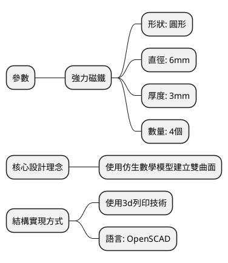

# 磁吸相關模型 (Magnetic)

## 子目錄資料夾說明

各應用模型放於此目錄下的子目錄中

## 原始需求架構 (PlantUML)

```plantuml
@startmindmap

* 參數
** 強力磁鐵
*** 形狀: 圓形
*** 直徑: 6mm
*** 厚度: 3mm
*** 數量: 4個

* 核心設計理念
** 使用仿生數學模型建立雙曲面

* 結構實現方式
** 使用3d列印技術
** 語言: OpenSCAD
@endmindmap
```
