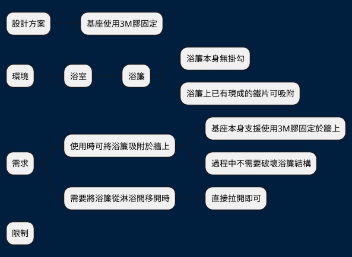

# 磁吸浴簾壁掛 (Magnetic Shower Curtain Wall Mount)

```plantuml
@startmindmap

skinparam backgroundColor #001f3f
skinparam componentStyle uml2

* 設計方案
** 基座使用3M膠固定

* 環境
** 浴室
*** 浴簾
**** 浴簾本身無掛勾
**** 浴簾上已有現成的鐵片可吸附

* 需求
** 使用時可將浴簾吸附於牆上
*** 基座本身支援使用3M膠固定於牆上
*** 過程中不需要破壞浴簾結構
** 需要將浴簾從淋浴間移開時
*** 直接拉開即可

* 限制

@endmindmap
```
