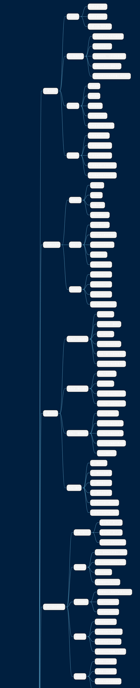

## 原始需求架構 (PlantUML)

```plantuml
@startmindmap
skinparam backgroundColor #001f3f
skinparam defaultFontColor white
skinparam ArrowColor #7FDBFF
skinparam LineColor #7FDBFF

* 桌緣坐姿療癒擺件\nSitting on a Ledge Figurine

** 1. 產品定位
*** 產品類型
**** 桌緣坐姿小擺件
**** 療癒型桌面裝飾
**** 可愛 Chibi 角色系列
*** 核心使用方式
**** 角色直接坐於既有物體邊緣
**** 不包含自帶平台
**** 不使用磁吸、卡扣或黏著固定
**** 雙腿自然垂掛於邊緣外側
**** 完全依靠自身幾何與重心保持穩定
*** 適用位置
**** 書桌邊緣
**** 層架邊緣
**** 床頭櫃邊緣
**** 顯示器底座邊緣
**** 收納盒或設備外殼邊緣
*** 使用限制
**** 放置面需維持平整
**** 不適用明顯傾斜表面
**** 不適用頻繁震動位置
**** 不建議放置於容易碰撞處
**** 不依賴桌面垂直側壁支撐

** 2. 外觀與風格
*** 整體風格
**** 可愛 Chibi
**** 圓潤輪廓
**** 低重心造型
**** 減少尖銳突出物
*** 頭身比例
**** 約 1.5 至 2 頭身
**** 頭部作為主要視覺焦點
**** 軀幹採短而厚實設計
**** 四肢適度加粗
**** 腳掌尺寸略微放大
*** 表面細節
**** 衣物使用簡化摺紋
**** 貓咪使用簡化毛髮
**** 五官採浮雕或凹刻
**** 避免過細且懸空的裝飾

** 3. 角色系列
*** 角色 A：浴袍造型
**** 圓潤浴袍衣領
**** 腰帶與軀幹一體成形
**** 袖口避免過薄
**** 雙手托腮或放於膝部
**** 浴袍下擺可作為後側支撐
**** 後側衣物可增加配重體積
*** 角色 B：睡衣造型
**** 寬鬆上衣與長褲
**** 衣物摺線簡化
**** 雙手抱膝或自然放於腿部
**** 後側軀幹可適度增加材料
*** 角色 C：貓咪造型
**** 前腳位於身體前方
**** 後腳形成主要坐姿支撐
**** 尾巴貼近身體或放置面
**** 尾巴可形成後側平衡結構
**** 耳朵尖端圓角化
*** 系列一致性
**** 統一頭身比例
**** 統一臀部坐面基準
**** 統一腿部垂掛方向
**** 統一適用桌緣深度
**** 各角色分別進行重心分析
**** 不直接共用相同重心數據

** 4. 尺寸與比例限制
*** 整體平面尺寸
**** 最大寬度：約 7 cm
**** 最大深度：約 7 cm
**** 可依角色姿勢局部縮減
*** 高度定義
**** 5 cm 僅限制放置面以上高度
**** 高度由臀部接觸面向上量測
**** 頭頂為最高點
**** 垂掛腿部不計入 5 cm
*** 上半部限制
**** 放置面以上高度不超過 50 mm
**** 頭部不可過度前伸
**** 軀幹避免過度前傾
*** 垂掛尺寸
**** 腿部長度另行標示
**** 腿部最低點不納入 5 cm
**** 左右腳高度可略有差異
**** 垂掛部分不得碰觸下方表面
*** 座面需求
**** 定義最小放置寬度
**** 定義最小放置深度
**** 臀部與大腿需完整接觸
**** 不限制特定桌板厚度

** 5. 坐姿與接觸區設計
*** 主要接觸區
**** 臀部底面
**** 大腿後側
**** 衣物下擺
**** 貓咪後腳
*** 可選輔助接觸區
**** 手掌接觸水平表面
**** 浴袍後側接觸水平表面
**** 貓咪尾巴接觸水平表面
*** 不列入接觸區
**** 垂掛的小腿與腳
**** 未實際接觸桌面的衣物
**** 列印後可能懸空的部位
**** 桌面垂直側壁
**** 外加固定零件
*** 接觸面要求
**** 臀部底面維持平整
**** 大腿後側延伸接觸面
**** 接觸區左右儘量對稱
**** 避免僅靠單一點接觸
**** 桌緣避空處採圓角處理
*** 支撐多邊形
**** 由實際接觸區外圍形成
**** 俯視圖標示支撐範圍
**** 包含所有有效接觸面
**** 不包含虛擬或懸空接觸點

** 6. 模型設計的重心規劃
*** 核心原則
**** 重心垂直投影位於支撐區內
**** 重心投影位於桌緣內側
**** 重心不得落於垂掛腿部一側
**** 重心位置避免靠近接觸區邊界
*** 座標基準
**** 桌面高度設定為 Z = 0
**** 桌緣設定為 X = 0
**** 桌面內側設定為 X 正值
**** 桌面外側設定為 X 負值
**** 重力方向沿 Z 軸向下
*** 前後安全區
**** 接觸區向內縮形成安全區
**** 重心距桌緣目標至少 3 至 5 mm
**** 或保留有效座深的 15% 至 25%
**** 重心建議位於臀部中心偏後
*** 左右安全區
**** 重心距左側邊界至少 2 至 3 mm
**** 重心距右側邊界至少 2 至 3 mm
**** 左右重量儘量維持平衡
**** 非對稱姿勢需個別分析
*** 重心高度
**** 降低頭部與軀幹重心高度
**** 避免頭部過高或過度前伸
**** 臀部保持較厚實
**** 重心越高需保留更大的水平裕度
*** 重量配置
**** 臀部與後側軀幹增加材料體積
**** 頭部可採中空設計
**** 垂掛腿部降低材料體積
**** 後背或衣物內部增加實心體積
**** 左右兩側填充比例保持平衡
*** 姿勢風險
**** 低風險：軀幹直立且雙手放膝
**** 低風險：手掌向後輔助支撐
**** 中風險：抱膝姿勢
**** 高風險：前傾托腮
**** 高風險：頭部與雙手同時前伸
**** 高風險：左右高度明顯不對稱

** 7. CAD 模型建立
*** 建模內容
**** 完整角色外觀
**** 實際臀部接觸面
**** 實際中空結構
**** 實際壁厚
**** 組裝接合處
*** 模型實體分區
**** 頭部
**** 上半身
**** 臀部與座面
**** 左右手臂
**** 左右垂掛腿部
**** 衣物或尾巴配重區
*** 材料設定
**** 指定實際列印材料密度
**** 不同材質分別指定密度
**** 中空結構不可視為實心
**** 黏著劑與附加零件納入重量
*** 分件原則
**** 分件僅服務列印與塗裝
**** 分件後不得改變預期重心
**** 接縫設於衣物線條
**** 接合處避開主要承重區
**** 不在臀部接觸面安排接縫

** 8. CAD 重心驗證
*** 重心計算
**** 計算模型總質量
**** 顯示模型質量中心
**** 記錄重心 X Y Z 座標
**** 比較實心與中空配置
*** 重心投影
**** 從重心沿重力方向向下投影
**** 投影至桌面 Z = 0
**** 確認投影點位於接觸區內
**** 確認投影點位於安全區內
*** 側視圖驗證
**** 檢查向桌外翻倒風險
**** 測量重心至桌緣水平距離
**** 確認 XCOM 大於安全裕度
*** 正視圖驗證
**** 檢查左右傾倒風險
**** 測量左側安全距離
**** 測量右側安全距離
**** 確認左右均保有安全裕度
*** 俯視圖驗證
**** 顯示有效支撐多邊形
**** 顯示內縮後安全區
**** 顯示重心垂直投影點
**** 標示最短邊界距離
*** 基本判定
**** XCOM 必須大於 0
**** 建議 XCOM 至少 3 至 5 mm
**** 左右裕度建議至少 2 至 3 mm
**** 投影點不可落在安全區邊界上

** 9. 力矩與傾倒分析
*** 桌緣旋轉支點
**** 將桌緣視為前傾旋轉軸
**** 比較內側與外側重量力矩
*** 內側穩定力矩
**** 內側質量乘以距離桌緣
**** 包含臀部與後側軀幹
**** 包含後側衣物或尾巴
*** 外側翻倒力矩
**** 外側質量乘以距離桌緣
**** 包含垂掛腿部
**** 包含前伸的手臂與頭部
*** 力矩判定
**** 內側穩定力矩需大於外側翻倒力矩
**** 淨穩定力矩需大於零
**** 避免淨穩定力矩接近零
**** 保留製造誤差與擾動裕度
*** 臨界傾斜角
**** M 為重心至桌緣水平距離
**** H 為重心至桌面的垂直高度
**** 臨界角約為 arctan(M / H)
**** 建議理論臨界角至少 8 度
**** 期望目標約 10 至 15 度
**** 高重心角色需提高安全距離
*** 模擬情境
**** 完全水平桌面
**** 桌面向外傾斜
**** 桌面左右傾斜
**** 輕微外力作用
**** 不同摩擦表面

** 10. 3D 列印與切片驗證
*** 列印方式
**** FDM 原型列印
**** 樹脂精細列印
*** 列印方向
**** 優先確保臀部底面平整
**** 支撐點避開主要接觸面
**** 保護臉部與衣物正面細節
**** 腿部可依需要分件列印
*** 填充規劃
**** 頭部降低填充率
**** 垂掛腿部降低填充率
**** 臀部提高填充率
**** 後側軀幹提高填充率
**** 左右填充比例保持一致
*** 切片後重量驗證
**** 檢查各部位預估重量
**** 比較切片重心與 CAD 重心
**** 納入支撐拆除後的重量差異
**** 納入黏著劑與組裝零件
*** 接觸面處理
**** 臀部底面不得放置支撐接點
**** 移除底面突點
**** 打磨底面至平整
**** 檢查是否因翹曲產生懸空
*** 列印完成後
**** 量測實際總重量
**** 檢查左右重量差異
**** 確認腿部沒有意外實心
**** 重新執行實體重心測試

** 11. 模型完成後的重心初測
*** 懸吊法
**** 選擇兩個以上懸吊點
**** 各懸吊位置標示垂直線
**** 垂直線交點推估實體重心
**** 與 CAD 重心位置進行比較
*** 平衡法
**** 使用窄邊支點逐步移動模型
**** 找出開始翻轉的位置
**** 推估前後方向重心位置
**** 左右方向另外測試
*** 底面投影法
**** 將實體重心位置投影至座面
**** 標示桌緣位置
**** 量測投影點與桌緣距離
**** 確認位於安全區內
*** 初測差異
**** 比較 CAD 與實測重心
**** 檢查填充率是否符合預期
**** 檢查是否有多餘支撐殘留
**** 檢查組裝件重量是否不對稱

** 12. 實體靜態穩定測試
*** 測試前提
**** 雙腳完全懸空
**** 腿部不得貼住桌面垂直側壁
**** 身體不得靠牆
**** 不使用磁吸、卡扣或黏著
**** 不使用外加固定平台
*** 水平靜置測試
**** 放置於水平桌緣
**** 靜置至少 10 分鐘
**** 觀察是否前傾
**** 觀察是否左右傾斜
**** 觀察是否持續向桌緣滑動
*** 靜態驗收
**** PASS：無前傾
**** PASS：無左右傾斜
**** PASS：無持續滑動
**** PASS：雙腳懸空仍保持穩定
**** FAIL：需要側壁才可保持穩定
**** FAIL：重心逐漸越過桌緣

** 13. 傾斜板測試
*** 前後方向
**** 平板朝桌緣方向逐步傾斜
**** 記錄開始滑動角度
**** 記錄開始翻倒角度
**** 記錄先滑動或先翻倒
*** 左右方向
**** 平板向左逐步傾斜
**** 平板向右逐步傾斜
**** 記錄左右翻倒角度
**** 比較左右方向差異
*** 結果判讀
**** 先滑動：摩擦力不足
**** 先翻倒：重心裕度不足
**** 滑動後翻倒：兩者皆需改善
**** 左右差異大：質量分布不對稱
*** 建議驗收
**** 實測翻倒角度不低於設計門檻
**** 建議最低門檻為 8 度
**** 期望目標為 10 至 15 度
**** 三個角色分別測試

** 14. 輕觸與擾動測試
*** 輕觸位置
**** 頭頂前方
**** 胸口
**** 左肩
**** 右肩
**** 垂掛腿部
**** 貓咪尾巴
*** 測試方式
**** 使用一致方向輕觸
**** 使用一致力道或彈簧測力計
**** 每個位置至少測試 3 次
**** 記錄位移及回復狀況
*** 驗收判定
**** PASS：輕觸後回復穩定
**** PASS：未持續朝桌緣旋轉
**** PASS：單腳受力不會直接掉落
**** FAIL：頭部輕觸即翻落
**** FAIL：左右任一方向容易側翻

** 15. 不同表面相容性測試
*** 測試表面
**** 木質桌面
**** 塑膠表面
**** 金屬表面
**** 霧面表面
**** 光滑貼皮表面
*** 測試重點
**** 是否持續滑動
**** 是否容易前傾
**** 接觸面是否刮傷桌面
**** 底面紋理是否影響穩定
*** 問題分類
**** 翻倒問題屬於重心與支撐區
**** 滑動問題屬於摩擦力
**** 翹曲問題屬於製造精度
**** 左右傾斜屬於重量不對稱
*** 驗收要求
**** 常見表面皆可穩定靜置
**** 不依賴特定高摩擦材質
**** 不造成桌面明顯刮痕

** 16. 結構強度測試
*** 高風險部位
**** 手腕
**** 腳踝
**** 膝部
**** 貓咪尾巴
**** 浴袍腰帶
**** 睡衣袖口
**** 耳朵尖端
*** 測試內容
**** 多次放置與取下
**** 輕觸腿部
**** 輕觸尾巴
**** 檢查接合處裂痕
**** 檢查臀部底面翹曲
*** 驗收要求
**** 手腕與腳踝不易斷裂
**** 尾巴具足夠強度
**** 臀部底面保持平整
**** 多次測試後重心未明顯改變

** 17. 測試失敗的修正方向
*** 重心太靠前
**** 頭部向後移動
**** 減少軀幹前傾角度
**** 減輕垂掛腿部重量
**** 減輕前伸手臂重量
**** 增加臀部後側體積
**** 增加後側衣物配重
*** 重心太高
**** 降低頭部高度
**** 將頭部改為中空
**** 加厚臀部與座面
**** 將重量集中於下半部
*** 左右不平衡
**** 調整手臂姿勢
**** 修正尾巴方向
**** 平衡左右填充率
**** 調整左右腿部體積
*** 容易滑動
**** 改善底面平整度
**** 增加細緻接觸紋理
**** 增加實際接觸面積
**** 排除底面支撐殘留
*** 接觸面不足
**** 加長大腿後側接觸區
**** 擴大臀部底面
**** 增加衣物下擺接觸面
**** 避免單點或線接觸
*** 臨界傾角不足
**** 增加重心至桌緣距離
**** 降低重心高度
**** 減少外側翻倒力矩
**** 增加內側穩定力矩

** 18. 設計迭代流程
*** 第一版：概念模型
**** 驗證比例
**** 驗證坐姿
**** 初步計算重心
**** 確認接觸區
*** 第二版：重心模型
**** 調整頭部位置
**** 調整腿部重量
**** 調整臀部體積
**** 驗證安全區
**** 計算臨界傾角
*** 第三版：列印原型
**** 執行水平靜置測試
**** 執行傾斜板測試
**** 執行輕觸擾動測試
**** 比較 CAD 與實體重心
*** 第四版：細節模型
**** 加入衣物與表面細節
**** 重新檢查重量分布
**** 重新執行重心計算
**** 重新驗證結構強度
*** 最終版
**** 完成所有測試
**** 記錄最終尺寸
**** 記錄實際重量
**** 記錄重心座標
**** 記錄臨界傾斜角
**** 建立最終列印參數

** 19. 最終驗收標準
*** 尺寸
**** 放置面以上高度不超過 50 mm
**** 最大寬度不超過約 70 mm
**** 最大深度不超過約 70 mm
**** 垂掛腿部尺寸獨立記錄
*** CAD 重心
**** 重心投影位於有效支撐區內
**** 重心投影位於安全區內
**** 前後安全距離建議至少 3 至 5 mm
**** 左右安全距離建議至少 2 至 3 mm
*** 穩定性
**** 雙腳懸空仍保持穩定
**** 水平靜置 10 分鐘不移動
**** 輕觸後可回復穩定
**** 不依賴桌面垂直側壁
*** 傾斜測試
**** 理論臨界傾角至少 8 度
**** 實測結果符合設計門檻
**** 左右翻倒角度無明顯差異
*** 表面相容性
**** 常見表面可正常放置
**** 不持續向桌緣滑動
**** 不刮傷接觸表面
*** 結構
**** 接觸底面無明顯翹曲
**** 四肢與尾巴具足夠強度
**** 多次放置後無鬆脫或裂痕
*** 驗收結果
**** PASS：可進入定版
**** CONDITIONAL PASS：小幅調整後複測
**** FAIL：返回重心與坐姿設計階段

** 20. 驗證紀錄
*** 基本資料
**** 角色名稱
**** 模型版本
**** 列印日期
**** 列印材料
**** 列印方式
**** 填充率
*** 尺寸資料
**** 放置面以上高度
**** 最大寬度
**** 最大深度
**** 垂掛腿部長度
**** 有效座深
*** 重心資料
**** CAD 重心 X 座標
**** CAD 重心 Y 座標
**** CAD 重心 Z 座標
**** 重心距桌緣
**** 左右安全距離
**** 理論臨界傾角
*** 實測資料
**** 實際總重量
**** 開始滑動角度
**** 前傾翻倒角度
**** 左側翻倒角度
**** 右側翻倒角度
**** 輕觸測試結果
*** 問題與修正
**** 問題描述
**** 問題類型
**** 修正方式
**** 修正後模型版本
**** 複測結果

@endmindmap
```
