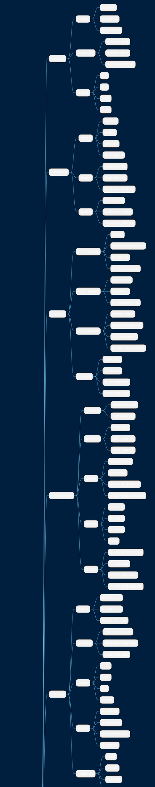

## 原始需求架構 (PlantUML)

```plantuml
@startmindmap
skinparam backgroundColor #001f3f
skinparam defaultFontColor white
skinparam ArrowColor #7FDBFF
skinparam LineColor #7FDBFF

* 桌緣坐姿療癒擺件\nSitting Ledge Tray Figurine

** 1. 產品定位
*** 產品類型
**** 坐姿小擺件
**** 桌面置物托盤
**** 療癒型桌面裝飾
*** 核心使用方式
**** 角色坐於平台前緣
**** 雙腿垂於平台外側
**** 平台後方保留置物空間
*** 適用位置
**** 書桌
**** 層架
**** 床頭櫃
**** 辦公桌

** 2. 外觀與風格
*** 整體風格
**** 可愛 Chibi
**** 圓潤輪廓
**** 低重心造型
**** 減少尖銳突出物
*** 表面質感
**** 衣物使用柔和摺紋
**** 貓咪使用簡化毛髮
**** 平台使用霧面或木紋質感
*** 頭身比例
**** 約 1.5 至 2 頭身
**** 頭部作為主要視覺焦點
**** 四肢適度加粗以提升強度

** 3. 角色系列
*** 角色 A：浴袍造型
**** 浴袍衣領
**** 腰帶以浮雕或連體方式呈現
**** 袖口避免過薄
**** 雙手可托腮或放於膝部
*** 角色 B：睡衣造型
**** 寬鬆上衣與長褲
**** 衣物摺線簡化
**** 雙手可抱膝或自然下垂
*** 角色 C：貓咪造型
**** 前腳放於平台邊緣
**** 後腳或尾巴形成輔助支撐
**** 耳朵尖端適度圓角化
**** 尾巴避免形成過細懸空結構
*** 系列一致性
**** 共用平台接口
**** 統一頭身比例
**** 統一坐高與臀部定位
**** 不同角色可替換安裝

** 4. 坐姿與人體工學
*** 主要承重點
**** 臀部接觸平台上表面
**** 大腿接觸平台前緣
*** 輔助支撐點
**** 手掌接觸平台
**** 衣物下擺接觸平台
**** 貓咪尾巴接觸平台
*** 腿部配置
**** 雙腿跨越平台前緣
**** 膝部自然彎曲
**** 腳部不得低於總高度限制
**** 左右腿可略微錯位增加自然感
*** 姿勢方案
**** 前傾托腮型
**** 雙手放膝型
**** 單手撐地型
**** 抱膝型
*** 重心控制
**** 重心投影位於臀部支撐區內
**** 不依靠腳部承重
**** 避免頭部前傾造成翻倒
**** 後方可利用衣物或尾巴平衡

** 5. 平台功能
*** 外部尺寸
**** 最大寬度：7 cm
**** 最大深度：7 cm
**** 平台高度：約 1.5 cm
*** 有效置物區
**** 目標空間：約 6 x 6 cm
**** 實際空間需扣除角色占用區
**** 建議標示淨置物範圍
*** 適用物品
**** 小公仔
**** 香薰石
**** 飾品
**** 小型文具
*** 邊緣設計
**** 後側防落擋邊
**** 左右側低矮擋邊
**** 前側保留角色坐姿缺口
**** 邊角圓角處理
*** 物品固定方式
**** 淺凹槽
**** 防滑紋理
**** 可選矽膠墊
**** 不建議使用過高圍牆

** 6. 尺寸與比例限制
*** 整體包絡尺寸
**** 寬度 X：不超過 7 cm
**** 深度 Y：不超過 7 cm
**** 高度 Z：不超過 5 cm
*** 高度分配
**** 平台高度：約 1.5 cm
**** 平台上方角色：約 3.5 cm
**** 垂掛腿部計入總高度
*** 角色占用範圍
**** 臀部占用平台前緣
**** 手部不得過度侵入置物區
**** 衣物與尾巴不得阻礙放置功能
*** 尺寸衝突檢查
**** 確認 6 x 6 cm 為外框或淨空間
**** 確認角色是否計入 7 x 7 cm
**** 確認腿部最低點是否計入 5 cm

** 7. 結構與穩定性
*** 結構原則
**** 臀部設為主要結構核心
**** 四肢與軀幹連接處加厚
**** 避免細長懸臂
**** 減少單點黏接
*** 防傾倒設計
**** 平台底部保持平整
**** 後側可配置隱藏配重區
**** 底面可增加防滑墊
**** 空載與置物狀態均需穩定
*** 高風險部位
**** 手腕
**** 腳踝
**** 貓咪尾巴
**** 浴袍腰帶
**** 睡衣袖口
**** 耳朵尖端
*** 強化方式
**** 關節圓角過渡
**** 手掌與腿部局部連接
**** 衣物下擺作為隱藏支撐
**** 小零件與主體一體化

** 8. 模塊化與組裝
*** 零件劃分
**** 零件 1：角色主體
**** 零件 2：放置平台
**** 選配：防滑底墊
*** 角色平台接口
**** 插榫定位
**** 磁吸定位
**** 卡扣定位
**** 永久黏合
*** 接口位置
**** 臀部底面
**** 手掌接觸處
**** 衣物下擺
**** 貓咪尾巴底部
*** 模塊化目標
**** 三種角色共用平台
**** 可替換角色
**** 有方向性防呆設計
**** 接合處盡量隱藏

** 9. 3D 列印可製造性
*** 列印方式
**** FDM 原型
**** 樹脂列印成品
*** 最小結構
**** 四肢避免過細
**** 衣物邊緣保留足夠厚度
**** 浮雕細節不得過淺
**** 卡榫需保留裝配公差
*** 支撐與懸空
**** 下巴避免大角度懸空
**** 手臂靠近身體
**** 腿部可拆件或調整列印方向
**** 披風與尾巴可作隱藏支撐
*** 後處理
**** 支撐拆除位置避開表面焦點
**** 分件接縫設於衣物線條
**** 預留打磨與上色空間

** 10. 驗證與驗收
*** 尺寸驗證
**** 整體尺寸符合 7 x 7 x 5 cm
**** 置物淨空符合需求
**** 腿部不超出限制範圍
*** 穩定性測試
**** 空載不翻倒
**** 放置香薰石後不翻倒
**** 輕微桌面震動不滑落
**** 角色與平台接口不鬆脫
*** 結構測試
**** 手腕與腳踝不易斷裂
**** 尾巴與耳朵具足夠強度
**** 平台不明顯翹曲
*** 使用體驗
**** 物品容易放入與取出
**** 角色不阻擋主要置物區
**** 無明顯尖角
**** 底部不刮傷桌面

** 11. 待確認事項
*** 6 x 6 cm 為平台外尺寸或淨置物尺寸
*** 5 cm 高度是否包含垂掛腿部
*** 公仔是否可從平台拆卸
*** 主要列印方式為 FDM 或樹脂
*** 香薰石的最大尺寸與重量
*** 平台是放在桌面或懸掛於桌緣
*** 是否需要承接香薰精油與防滲漏

@endmindmap
```
