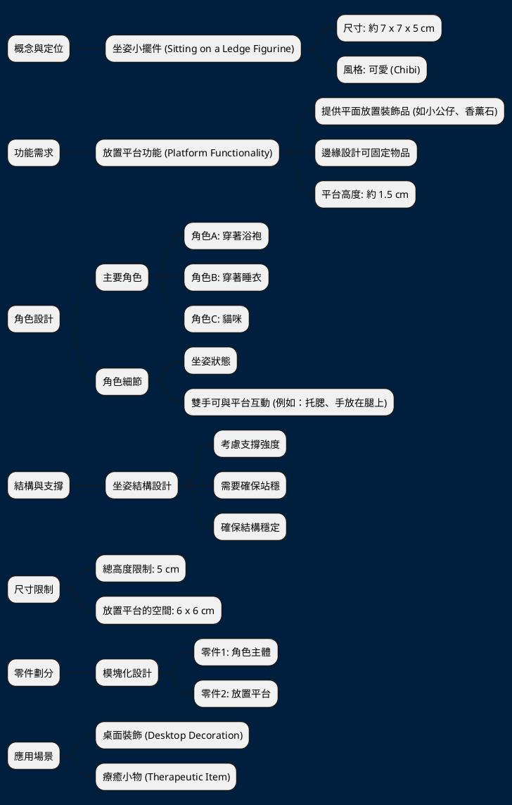

## 原始需求架構 (PlantUML)

```plantuml
@startmindmap
skinparam backgroundColor #001f3f

* 概念與定位
** 坐姿小擺件 (Sitting on a Ledge Figurine)
*** 尺寸: 約 7 x 7 x 5 cm
*** 風格: 可愛 (Chibi)

* 功能需求
** 放置平台功能 (Platform Functionality)
*** 提供平面放置裝飾品 (如小公仔、香薰石)
*** 邊緣設計可固定物品
*** 平台高度: 約 1.5 cm

* 角色設計
** 主要角色
*** 角色A: 穿著浴袍
*** 角色B: 穿著睡衣
*** 角色C: 貓咪

** 角色細節
*** 坐姿狀態
*** 雙手可與平台互動 (例如：托腮、手放在腿上)

* 結構與支撐
** 坐姿結構設計
*** 考慮支撐強度
*** 需要確保站穩
*** 確保結構穩定

* 尺寸限制
** 總高度限制: 5 cm
** 放置平台的空間: 6 x 6 cm

* 零件劃分
** 模塊化設計
*** 零件1: 角色主體
*** 零件2: 放置平台

* 應用場景
** 桌面裝飾 (Desktop Decoration)
** 療癒小物 (Therapeutic Item)

@endmindmap
```
