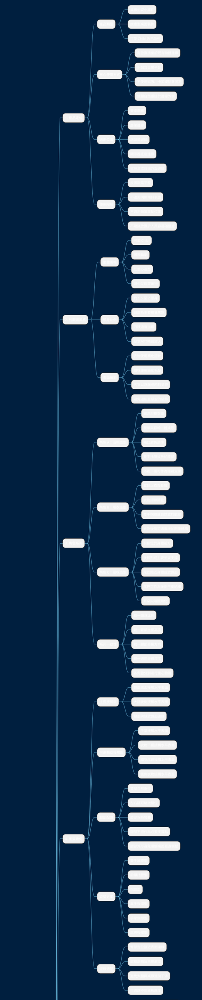

## 原始需求架構 (PlantUML)

```plantuml
@startmindmap
skinparam backgroundColor #001f3f
skinparam defaultFontColor white
skinparam ArrowColor #7FDBFF
skinparam LineColor #7FDBFF

* 桌緣坐姿療癒擺件\nSitting on a Ledge Figurine

** 1. 產品定位
*** 產品類型
**** 桌緣坐姿小擺件
**** 療癒型桌面裝飾
**** 可愛 Chibi 角色系列
*** 核心使用方式
**** 角色直接坐於既有物體邊緣
**** 不包含自帶平台
**** 不使用磁吸、卡扣或黏著固定
**** 雙腿自然垂掛於邊緣外側
*** 適用位置
**** 書桌邊緣
**** 層架邊緣
**** 床頭櫃邊緣
**** 顯示器底座邊緣
**** 收納盒或設備外殼邊緣
*** 使用限制
**** 放置面需平整
**** 不適用明顯傾斜表面
**** 不適用頻繁震動位置
**** 不建議放置於人員容易碰撞處

** 2. 外觀與風格
*** 整體風格
**** 可愛 Chibi
**** 圓潤輪廓
**** 低重心造型
**** 減少尖銳突出物
*** 頭身比例
**** 約 1.5 至 2 頭身
**** 頭部為主要視覺焦點
**** 四肢適度加粗
**** 腳掌尺寸略微放大
*** 表面細節
**** 衣物使用簡化摺紋
**** 貓咪使用簡化毛髮
**** 五官以浮雕或凹刻呈現
**** 避免過細且懸空的裝飾

** 3. 角色系列
*** 角色 A：浴袍造型
**** 圓潤浴袍衣領
**** 腰帶與軀幹一體成形
**** 袖口避免過薄
**** 雙手托腮或放於膝部
**** 浴袍下擺可作為隱藏支撐
*** 角色 B：睡衣造型
**** 寬鬆上衣與長褲
**** 衣物摺線簡化
**** 雙手抱膝或自然放於腿部
**** 衣物後側可適度增加配重體積
*** 角色 C：貓咪造型
**** 前腳位於身體前方
**** 後腳形成主要坐姿支撐
**** 尾巴貼近身體或放置面
**** 尾巴可作為後側平衡結構
**** 耳朵尖端圓角化
*** 系列一致性
**** 統一頭身比例
**** 統一臀部坐面高度
**** 統一腿部垂掛方向
**** 統一適用邊緣深度
**** 各角色分別進行重心驗證

** 4. 坐姿幾何
*** 主要接觸區
**** 臀部底面接觸水平表面
**** 大腿後側接觸水平表面
**** 腿部跨越放置面邊緣
*** 可選輔助接觸區
**** 手掌接觸水平表面
**** 衣物下擺接觸水平表面
**** 貓咪尾巴接觸水平表面
**** 後側衣物接觸水平表面
*** 腿部配置
**** 雙腿自然垂掛
**** 左右腿可略微錯位
**** 膝部保持彎曲
**** 腳部不得作為必要支撐點
**** 腿部外形避免碰觸桌面垂直側壁
*** 姿勢方案
**** 雙手放膝型
**** 前傾托腮型
**** 抱膝型
**** 單手後撐型
**** 手掌側撐型
**** 尾巴後撐型
*** 邊緣適配
**** 臀部定位接近表面邊緣
**** 腿根處預留桌緣避空
**** 避免大腿與桌緣幾何干涉
**** 可適應不同桌板厚度

** 5. 重心與防傾倒
*** 核心原則
**** 完全依靠自身幾何保持穩定
**** 不依賴平台、磁吸或卡扣
**** 不依賴腳部碰觸下方表面
**** 靜止狀態不得自行向前翻落
*** 重心位置
**** 整體重心投影位於接觸區內
**** 重心投影需落在桌緣內側
**** 重心不可落於垂掛腿部一側
**** 建議重心位於臀部中心偏後
*** 重心調整方式
**** 頭部位置略向後收
**** 軀幹避免過度前傾
**** 腿部採中空或減少材料體積
**** 臀部與軀幹增加材料體積
**** 後背或衣物內部增加實心體積
**** 貓咪尾巴向後配置
*** 防翻倒結構
**** 增加臀部接觸面積
**** 加長大腿後側接觸區
**** 手掌可作為次要支撐點
**** 衣物下擺可向後延伸形成支撐
**** 底部採平坦或微凹接觸面
*** 防滑設計
**** 接觸底面保持平整
**** 接觸面增加細緻紋理
**** 避免過度光滑的底面
**** 不使用外加防滑墊作必要條件
*** 穩定裕度
**** 正常靜置不翻落
**** 輕微桌面震動不滑落
**** 輕觸後可回復穩定
**** 角色前後方向保留安全重心裕度

** 6. 尺寸與比例限制
*** 整體平面尺寸
**** 最大寬度：約 7 cm
**** 最大深度：約 7 cm
**** 依角色姿勢允許局部縮減
*** 高度定義
**** 5 cm 僅限制放置面以上高度
**** 垂掛腿部不計入 5 cm
**** 高度從臀部接觸面向上量測
**** 頭頂為高度最高點
*** 上半部尺寸
**** 坐姿上半部高度不超過 5 cm
**** 頭部需保留足夠造型空間
**** 軀幹以短而厚實為原則
**** 頭部不可過度前伸
*** 垂掛尺寸
**** 腿部長度另行標示
**** 腿部最低點不納入 5 cm 限制
**** 左右腳高度可略有差異
**** 垂掛深度需避免影響重心
*** 座面需求
**** 定義最小放置深度
**** 定義最小放置寬度
**** 臀部與大腿需完整接觸
**** 不應要求特定桌板厚度

** 7. 結構強度
*** 結構原則
**** 臀部為主要結構核心
**** 軀幹與臀部一體化
**** 四肢與身體連接處加厚
**** 避免細長懸臂
**** 減少單點連接
*** 高風險部位
**** 手腕
**** 腳踝
**** 膝部
**** 貓咪尾巴
**** 浴袍腰帶
**** 睡衣袖口
**** 耳朵尖端
*** 強化方式
**** 關節使用圓角過渡
**** 手部靠近膝部或軀幹
**** 左右腿可局部連接
**** 衣物下擺與臀部一體化
**** 尾巴貼近身體或放置面
**** 小型裝飾採浮雕方式呈現

** 8. 零件劃分
*** 主要方案
**** 單一角色主體
**** 無獨立平台零件
**** 無磁吸零件
**** 無卡扣零件
*** 可選分件方式
**** 頭部與身體分件
**** 身體與腿部分件
**** 左右腿個別分件
*** 分件原則
**** 分件僅服務列印與塗裝
**** 組裝後不得影響重心
**** 接縫設於衣物線條
**** 接合處避免位於主要承重區
*** 組裝限制
**** 不將組裝接點設於臀部底面
**** 不將接合縫設於膝部承力點
**** 不使左右重量明顯不對稱

** 9. 3D 列印可製造性
*** 列印方式
**** FDM 原型列印
**** 樹脂精細列印
*** 列印方向
**** 優先確保臀部接觸面平整
**** 保護臉部與衣物正面細節
**** 支撐點避開主要接觸面
**** 腿部可依需要分件列印
*** 懸空控制
**** 下巴避免大角度懸空
**** 手臂靠近身體
**** 手掌靠近腿部或座面
**** 腳掌避免過薄
*** 重量控制
**** 垂掛腿部降低填充率
**** 頭部避免完全實心
**** 臀部與後側軀幹提高填充率
**** 左右填充比例保持對稱
*** 後處理
**** 臀部底面需打磨平整
**** 移除底面突點與支撐痕跡
**** 不破壞後側配重區
**** 完成後重新檢查重心

** 10. 建模驗證
*** 數位重心分析
**** 計算整體質量中心
**** 標示重心垂直投影
**** 比對有效接觸區域
**** 比較實心與中空配置
*** 幾何干涉檢查
**** 大腿與桌緣干涉
**** 小腿與垂直側壁干涉
**** 手掌與放置面干涉
**** 衣物下擺與桌緣干涉
*** 姿勢比較
**** 比較前傾角度
**** 比較頭部前後位置
**** 比較腿部重量
**** 比較手部支撐方案
*** 原型迭代
**** 第一版驗證比例與坐姿
**** 第二版調整重心位置
**** 第三版驗證細節與強度
**** 最終版進行穩定性驗收

** 11. 實體驗收
*** 尺寸驗證
**** 放置面以上高度不超過 5 cm
**** 寬度與深度符合設計限制
**** 垂掛腿部尺寸另行記錄
*** 靜態穩定測試
**** 放置後不得自行前傾
**** 放置後不得左右傾倒
**** 雙腳懸空時仍保持穩定
**** 不依賴牆面或下方表面支撐
*** 擾動測試
**** 輕觸頭部後不翻落
**** 輕觸腿部後不翻落
**** 輕微桌面震動不滑落
**** 多次放置後仍可保持穩定
*** 表面相容性
**** 木質桌面
**** 塑膠表面
**** 金屬表面
**** 霧面表面
**** 光滑表面
*** 結構測試
**** 手腕不易斷裂
**** 腳踝不易斷裂
**** 尾巴具足夠強度
**** 臀部底面無明顯翹曲
*** 使用體驗
**** 容易放置與取下
**** 無明顯尖角
**** 不刮傷接觸表面
**** 正面觀看姿勢自然

** 12. 建議設計參數
*** 重心安全區
**** 重心投影位於桌緣內側
**** 避免重心投影緊貼桌緣
**** 保留前後穩定裕度
*** 坐面幾何
**** 臀部底面採平面
**** 大腿後側形成延伸接觸面
**** 桌緣避空處使用圓角
**** 接觸面左右保持對稱
*** 角色姿勢優先順序
**** 最穩定：軀幹直立且雙手放膝
**** 次穩定：單手或雙手後撐
**** 需驗證：前傾托腮
**** 高風險：頭部大幅前伸
**** 高風險：雙手與軀幹完全懸空

@endmindmap
```
